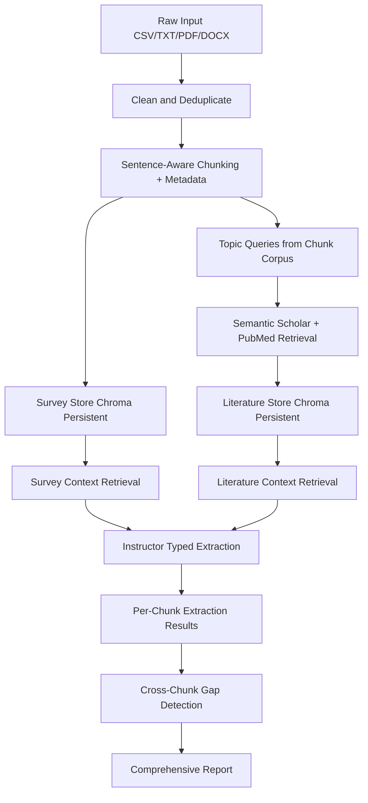

# Architecture

## System Summary

The pipeline ingests qualitative data from multiple file formats, cleans and deduplicates responses, chunks them into sentence-aware units, and stores survey chunks in a persistent vector store. It then builds a second literature vector store (Semantic Scholar + PubMed abstracts), performs typed model extraction per chunk using instructor-backed schema validation, and runs a cross-chunk gap detection pass with completeness/testability scoring.

Primary components:
- [`main.py`](main.py): CLI orchestration and reporting
- [`src/llm_survey/utils/preprocess.py`](src/llm_survey/utils/preprocess.py): multi-format parsing, cleaning, deduplication, chunking, metadata
- [`src/llm_survey/rag/survey_store.py`](src/llm_survey/rag/survey_store.py): persistent survey vector store with content-hash dedupe
- [`src/llm_survey/rag/literature_store.py`](src/llm_survey/rag/literature_store.py): persistent literature vector store
- [`src/llm_survey/rag/semantic_scholar.py`](src/llm_survey/rag/semantic_scholar.py): Semantic Scholar retrieval
- [`src/llm_survey/rag/pubmed_client.py`](src/llm_survey/rag/pubmed_client.py): PubMed retrieval
- [`src/llm_survey/rag_pipeline.py`](src/llm_survey/rag_pipeline.py): dual-context retrieval + structured extraction
- [`src/llm_survey/schemas/extraction.py`](src/llm_survey/schemas/extraction.py): typed extraction schema
- [`src/llm_survey/agents/gap_detection.py`](src/llm_survey/agents/gap_detection.py): cross-chunk gap detection and scoring
- [`src/llm_survey/schemas/gap.py`](src/llm_survey/schemas/gap.py): gap report schema

## Data Flow

## Outputs

- [`data/processed/processed_chunks.json`](data/processed/processed_chunks.json)
- `data/processed/chunks_<run_id>.json` (run-scoped)
- [`outputs/extracted_models.json`](outputs/extracted_models.json)
- `outputs/extracted_models_<run_id>.json` (run-scoped)
- `outputs/cross_chunk_gap_report.json`
- `outputs/cross_chunk_gap_report_<run_id>.json`
- [`outputs/comprehensive_report.json`](outputs/comprehensive_report.json)
- [`outputs/topic_analysis.json`](outputs/topic_analysis.json) (when topic analysis is enabled)
