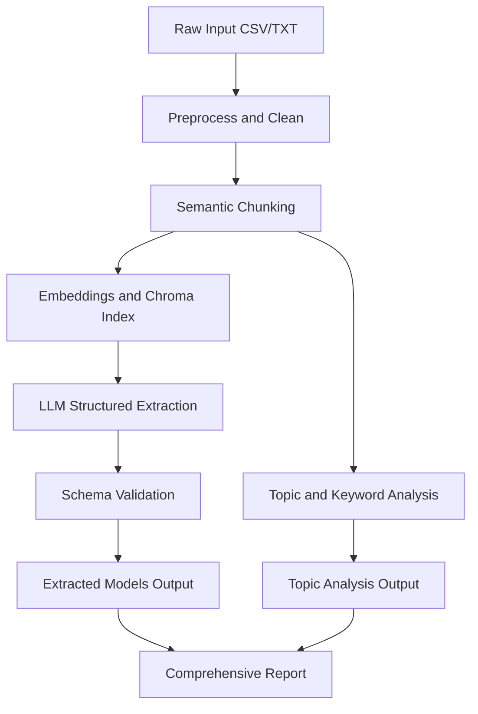

# Architecture

## System Summary

The pipeline ingests raw qualitative text, transforms it into semantically meaningful chunks, indexes those chunks in a vector store, and uses an LLM to extract structured scientific-model elements. Topic analysis then summarizes thematic patterns across responses, and outputs are written for downstream reporting.

Primary components:
- [`main.py`](main.py): orchestration and run flow
- [`src/llm_survey/rag_pipeline.py`](src/llm_survey/rag_pipeline.py): chunking, embeddings, retrieval, structured extraction
- [`src/llm_survey/topic_analysis.py`](src/llm_survey/topic_analysis.py): BERTopic and keyword analysis
- [`src/llm_survey/utils/preprocess.py`](src/llm_survey/utils/preprocess.py): cleaning and chunk preparation
- [`ui/dashboard.py`](ui/dashboard.py): interactive UI

## Data Flow

## Outputs

- [`data/processed/processed_chunks.json`](data/processed/processed_chunks.json)
- [`outputs/extracted_models.json`](outputs/extracted_models.json)
- [`outputs/topic_analysis.json`](outputs/topic_analysis.json)
- [`outputs/comprehensive_report.json`](outputs/comprehensive_report.json)
- [`outputs/plots/`](outputs/plots/) (visualizations)
