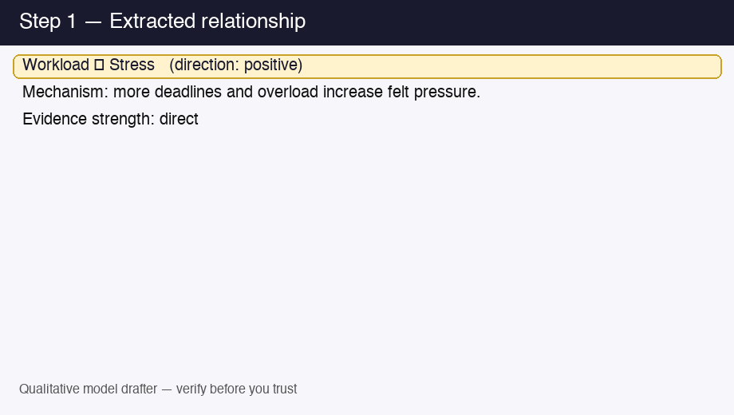

# LLM Model Specification Generator

## Overview

This project turns qualitative survey or interview text into a **structured first draft** of a scientific model, with **quotes and chunk ids** attached so a researcher can verify before trusting.

## Read next (trust)

1. [How the structural coverage score works](docs/structural-coverage-score.md)
2. [What this tool gets wrong](docs/limitations.md)
3. [Evaluation (single synthetic corpus)](docs/evaluation.md)

Core capabilities:
- multi-format ingestion (`.csv`, `.txt`, `.pdf`, `.docx`) with cleaning, deduplication, and metadata enrichment
- dual-RAG retrieval with persistent survey and literature stores
- LLM-based structured extraction (typed schema via instructor + Pydantic)
- cross-chunk gap detection with a **structural coverage** heuristic and a separate testability heuristic (neither is “truth”)
- clarification planning with question routing (`researcher`/`literature`/`either`) and literature auto-answers
- iterative refinement loop (default **2** iterations, with early stop if coverage gains stall)
- deterministic consolidation of chunk-level findings into one reviewable model
- contradiction detection with subgroup-aware resolution attempts
- per-hypothesis literature validation with support, contestation, and novelty flags
- human-review UI for editing consolidated variables, relationships, and hypotheses before export
- final exports for YAML model specs, Mermaid diagrams, causal-graph HTML, Markdown evidence reports, JSON, and DOCX appendix
- topic modeling and keyword analysis for cross-response patterns

Main entry points:
- CLI: [`main.py`](main.py)
- Smoke test: [`scripts/smoke_e2e.py`](scripts/smoke_e2e.py)
- Streamlit UI: [`app.py`](app.py) (Hugging Face Spaces entry) or [`ui/dashboard.py`](ui/dashboard.py)

Additional documentation:
- Architecture: [`ARCHITECTURE.md`](ARCHITECTURE.md)
- Docs index: [`docs/README.md`](docs/README.md)

## Demo (provenance)



Regenerate: `python3 scripts/generate_provenance_demo_gif.py`

## Setup

1. Install dependencies:

```bash
pip install -r requirements.txt
```

2. Configure environment variables (copy from [`.env.example`](.env.example)):

- `OPENROUTER_API_KEY` (optional if you pass `--api-key`; the Streamlit UI expects a **bring-your-own-key** field and keeps it in session only)
- `OPENROUTER_BASE_URL` (optional, default: `https://openrouter.ai/api/v1`)
- `OPENROUTER_MODEL` (optional, example: `google/gemma-4-31b-it:free`)
- `HF_TOKEN` (gated embedding models locally; also used by `scripts/push_hf_space.py` / CI to sync a Space)
- `OPENROUTER_HTTP_REFERER` (optional)
- `OPENROUTER_X_TITLE` (optional)

## Usage

Run the full pipeline:

```bash
python main.py --input data/raw/synthetic_workplace_survey.csv --api-key YOUR_OPENROUTER_KEY
```

Disable literature retrieval if you want a faster/offline-friendly run:

```bash
python main.py --input data/raw/synthetic_workplace_survey.csv --api-key YOUR_OPENROUTER_KEY --no-literature
```

Disable iterative refinement loop:

```bash
python main.py --input data/raw/synthetic_workplace_survey.csv --api-key YOUR_OPENROUTER_KEY --no-refinement
```

Run the smoke test:

```bash
python scripts/smoke_e2e.py
```

Run the Streamlit app (preferred for Hugging Face):

```bash
python -m streamlit run app.py
```

## License

See [LICENSE](LICENSE) (MIT).

## Deploying to Hugging Face Spaces

Use **CPU Basic** + **Docker** SDK (the Space runs Streamlit inside the container from `Dockerfile`). The YAML block at the top of this file is the Space card. **Do not** add an OpenRouter secret to the Space — users paste their own key in the UI.

### One-shot push from your laptop

```bash
export HF_TOKEN="hf_…"   # or HUGGING_FACE_HUB_TOKEN
# Optional: defaults to <your_hf_username>/qualitative-model-drafter
export HF_SPACE_REPO="yourname/qualitative-model-drafter"

pip install "huggingface_hub>=0.26.0"
python3 scripts/push_hf_space.py
# If API create returns 403, create the Space once in the HF UI (Docker), then:
# HF_SPACE_REPO=you/name python3 scripts/push_hf_space.py --upload-only
```

Creates the Space if it does not exist, then uploads the repo (excluding chroma, outputs, venv, etc.). Full notes: [`docs/deploy-hf.md`](docs/deploy-hf.md).

### GitHub Actions (optional)

Set repository secrets `HF_TOKEN` and `HF_SPACE_REPO`, then merges to `main` trigger [`.github/workflows/deploy-hf-space.yml`](.github/workflows/deploy-hf-space.yml).
