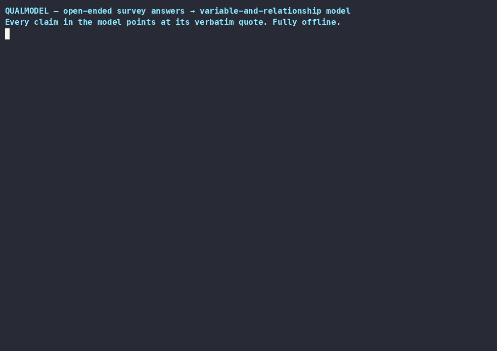

# QualModel (LLM Survey Model Specification)

> Turns open-ended survey answers into a verifiable variable-and-relationship model — every claim backed by its verbatim quote.

<p align="center"></p>
<details><summary><b>▶ Watch the full demo (~25s)</b></summary>
<video src="assets/demo/demo.mp4" controls width="720"></video></details>

## Why this exists

Qualitative survey analysis is largely manual: researchers read hundreds of
free-text answers and summarize them into themes and causal claims, often by
hand or with tools that hide the underlying text. The result is hard to
reproduce — and the link between a conclusion and the quote that supports it
is usually lost somewhere between the transcripts and the report. This project
makes that link the deliverable: a structured, machine-readable
variable-and-relationship model in which every claim carries its verbatim
evidence, so a reviewer can check the reasoning instead of trusting the
summary.

## What it does

- **Ingestion and preprocessing** — parses CSV, TXT, PDF, and DOCX; cleans,
  deduplicates, and sentence-aware chunks responses into a persistent vector
  store (`src/llm_survey/utils/preprocess.py`).
- **Literature grounding (RAG)** — auto-builds a literature corpus from
  Semantic Scholar + PubMed on the survey's own topics, and retrieves the
  nearest abstracts as context for each extraction (disable with
  `--no-rag` / `--no-literature`).
- **Typed extraction agents** — per-chunk extraction of variables,
  relationships, hypotheses, and moderators into Pydantic schemas enforced via
  instructor structured output, with versioned prompts and `temperature=0`.
- **Gap detection and clarification** — cross-chunk gap analysis with
  structural-coverage and testability scores, a researcher-routed
  clarification plan, and an iterative refinement loop that re-extracts until
  completeness improves or loop limits are hit.
- **Consolidation with provenance** — merges per-chunk models, detects and
  resolves contradictions (deterministic rules, then literature), scores
  hypotheses against the literature corpus, and preserves each claim's
  supporting verbatim quote and chunk id through every step.
- **Provenance-first exports** — YAML model spec, Mermaid graph + interactive
  HTML, Markdown evidence report (claim → quote), DOCX appendix, JSON bundle,
  and a per-run `runlog.json` recording prompts, model, seed, and git state.

## Architecture

```
 survey text (CSV / TXT / PDF / DOCX)
        |  clean - dedupe - sentence-aware chunking
        v
 survey chunks --------------> survey vector store (Chroma)
        |                               |
        v                               v
 topic queries -> Semantic Scholar + PubMed -> literature vector store
        |                               |
        +-------------------------------+
        v
 typed per-chunk extraction (instructor + Pydantic, temperature=0)
        |
        v
 cross-chunk gap detection -> clarification plan -> refinement loop (bounded)
        |
        v
 consolidation / contradiction detection / literature scoring
        |
        v
 model spec: YAML / Mermaid / evidence report (claim -> verbatim quote)
```

Key modules: `main.py` (CLI, entrypoint `llm-survey`); `src/llm_survey/rag/`
(survey + literature stores, Semantic Scholar / PubMed clients);
`src/llm_survey/rag_pipeline.py` (dual-context retrieval, extraction,
refinement loop); `src/llm_survey/agents/` (gap detection, clarification,
consolidation); `src/llm_survey/schemas/` (typed models);
`src/llm_survey/utils/export_reports.py` (all exports). Full walkthrough:
[ARCHITECTURE.md](ARCHITECTURE.md).

## Quick start

Requires Python ≥ 3.10 and [uv](https://docs.astral.sh/uv/).

```bash
git clone https://github.com/haseebraza715/QualModel.git
cd QualModel
uv sync            # locked, hash-pinned environment
./scripts/demo.sh  # fully offline: no API key, no network
```

## Demo

`./scripts/demo.sh` runs the deterministic phases of the pipeline over the
committed fixture extractions in `docs/fixtures/`. In about a minute it shows:

- **The input** — 20 open-ended workplace-survey responses.
- **The pipeline** — gap detection → clarification planning → consolidation →
  contradiction detection → exports (`scripts/demo_offline_build.py`).
- **The model spec** — 15 variables, 10 relationships, 10 scored hypotheses in
  `outputs/demo/final_model_spec.yaml` plus a Mermaid causal graph.
- **Quote-level provenance** — each hypothesis and relationship rendered with
  the verbatim quote and chunk that support it (`outputs/demo/evidence_report.md`).
- **What the model still doesn't know** — gap report with coverage/testability
  scores and researcher-routed clarification questions.

To regenerate the demo artifacts: `./scripts/demo.sh`, or
`python3 scripts/demo_offline_build.py` for just the build. To run the live
pipeline with real LLM extraction instead (needs an OpenRouter key):

```bash
export OPENROUTER_API_KEY=sk-or-...
uv run python3 main.py -i data/raw/synthetic_workplace_survey.csv
```

## Technical decisions

- **Provenance-first schema.** The extraction schema requires every
  relationship and hypothesis to carry `supporting_quote` and
  `source_chunk_ids`; a claim without a quote is not representable. The
  consolidator keeps `supporting_quotes` and `contradicting_quotes` lists
  through merging, and every export renders claim → quote, so provenance
  cannot be dropped by post-processing.
- **Determinism as a design constraint.** Decoding is `temperature=0` with a
  fixed seed; prompts are versioned and recorded by sha256 in `runlog.json`.
  The offline demo derives its `generated_at` from the git commit date and
  pins DOCX zip timestamps, making all twelve demo artifacts byte-for-byte
  reproducible from a checkout — enforced by a regression test.
- **Bounded agentic loop.** Refinement is not open-ended: gap detection scores
  structural coverage, re-extraction stops early once coverage passes the
  completeness threshold (default 0.75) or `max_refinement_iterations`
  (default 2) is reached, and contradictions are resolved with deterministic
  rules (subgroup, then literature) with the remainder flagged
  `requires_researcher_input`.
- **User text is treated as data.** Every user-derived string — chunk text,
  speaker ids — passes through a sanitizer (sentinel stripping, brace
  neutralization, jailbreak-phrase redaction) before prompt interpolation, is
  never fed through `str.format` as part of a template, and is HTML-escaped on
  export. This removes a class of prompt-injection bugs; it is not a formal
  security guarantee against a determined adversary.

## Validation

236 tests pass (1 skipped — a live-API gate requiring an OpenRouter key) with
`python -m pytest tests -q --no-header -p no:warnings`, including
byte-determinism checks for the offline demo and eval metrics; ruff, black,
and mypy are clean on the CI-scoped file set.
[](.github/workflows/ci.yml)

## Limitations

- The offline demo replays the pipeline's deterministic phases over committed
  fixture extractions; the extraction phase itself requires a live LLM call.
- The bundled evaluation rests on one synthetic 20-row corpus (a 9-edge
  fixture subset drives the offline metrics; the 15-edge gold set is for live
  runs) — bootstrap CIs are wide, and a real-data coder-agreement
  experiment (NOAA storm corpus, `docs/real-evidence/`) shows low exact-name
  agreement between coders, meaning construct vocabulary needs human control
  before these numbers mean much.
- The structural-coverage score is a heuristic over schema gaps, not
  theoretical saturation or coding completeness.
- Literature support scores depend on what Semantic Scholar / PubMed return
  and on cue-based stance classification; they are hints for review, not
  citations.
- Topic analysis requires downloading an embedding model on first use and is
  excluded from the offline demo.
- Quality on non-English text and complex PDF layouts is untested; survey
  responses are treated as hostile input (sanitized) but that is friction,
  not a guarantee.

See [docs/limitations.md](docs/limitations.md) for the blunt version, and
[NEXT_STEPS.md](NEXT_STEPS.md) for the honest punch list.

## Links

- [ARCHITECTURE.md](ARCHITECTURE.md) — pipeline deep dive
- [REPRODUCE.md](REPRODUCE.md) — reproduction recipe
- [docs/evaluation.md](docs/evaluation.md) — metric harness and numbers
- [docs/agreement-eval.md](docs/agreement-eval.md) — real-data coder agreement
- [docs/deploy-hf.md](docs/deploy-hf.md) — Hugging Face Space deployment

## License

[MIT](LICENSE).
