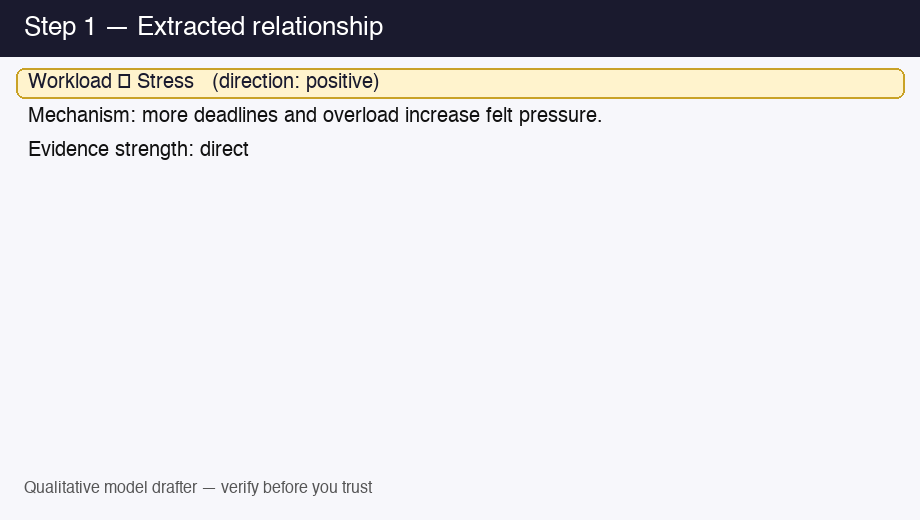

# LLM Survey Model Specification

> **A reproducible research pipeline that turns qualitative survey or interview
> text into a structured causal model — variables, relationships, hypotheses,
> moderators — with quote-level provenance attached to every claim, so a
> researcher can verify before they trust.**

This repo is a research instrument, not a product. It ships with a deterministic
evaluation harness, bootstrap confidence intervals, an ablation runner, a
versioned prompt registry, and a `make reproduce` recipe for the explicitly
listed deterministic fixture metrics. Live-model, ablation, latency, and cost
claims require separately archived run artifacts.



---

## Table of contents

- [What it does](#what-it-does)
- [How the pipeline works](#how-the-pipeline-works)
- [Quickstart](#quickstart)
- [Reproducibility](#reproducibility)
- [Evaluation](#evaluation)
- [Ablation studies](#ablation-studies)
- [Configuration](#configuration)
- [Repository layout](#repository-layout)
- [What's still missing](#whats-still-missing)
- [Deploying to Hugging Face Spaces](#deploying-to-hugging-face-spaces)
- [Citing](#citing)
- [License](#license)

---

## What it does

Given a CSV / TXT / PDF / DOCX of open-ended survey or interview responses, the
pipeline produces a **consolidated causal model** with:

- typed **variables**, **relationships**, **hypotheses**, and **moderators**;
- a **supporting quote** + chunk id for every extracted claim (provenance);
- a **structural-coverage** score and a **testability** score;
- **clarification questions** for the gaps the model still has;
- a **contradiction report** when claims disagree across responses;
- a **literature-validation report** scoring each hypothesis as supported,
  contested, or novel against an automatically-built literature corpus;
- exports to **YAML model spec**, **Mermaid causal graph**, **HTML graph**,
  **Markdown evidence report**, **JSON bundle**, and **DOCX appendix**.

It is built around an **8-phase pipeline** with two persistent ChromaDB vector
stores (one for the survey itself, one for retrieved literature), iterative
refinement, and a deterministic consolidation step.

---

## How the pipeline works

```
  ┌────────────────┐   ┌──────────────────┐   ┌──────────────────┐
  │ 1. Ingest +    │ → │ 2. Literature    │ → │ 3. Per-chunk     │
  │    chunk       │   │    RAG (PubMed,  │   │    extraction    │
  │    + embed     │   │    SemScholar)   │   │    (typed JSON)  │
  └────────────────┘   └──────────────────┘   └────────┬─────────┘
                                                       │
                                                       ▼
  ┌────────────────┐   ┌──────────────────┐   ┌──────────────────┐
  │ 8. Final       │ ← │ 7. Consolidate + │ ← │ 4. Cross-chunk   │
  │    exports     │   │    contradict    │   │    gap detection │
  │    (YAML, MD,  │   │    + literature  │   │                  │
  │    HTML, DOCX) │   │    validation    │   │                  │
  └────────────────┘   └──────────────────┘   └────────┬─────────┘
                                                       │
                                ┌──────────────────────┴──────┐
                                ▼                             ▼
                       ┌────────────────┐            ┌────────────────┐
                       │ 5. Clarification│           │ 6. Refinement  │
                       │    planning    │            │    loop        │
                       │    (auto-answer│            │    (≤ N iters) │
                       │    from lit)   │            │                │
                       └────────────────┘            └────────────────┘
```

| # | Phase | What it does | Key file |
|---|-------|--------------|----------|
| 1 | Ingest & chunk | Parse CSV/TXT/PDF/DOCX, clean, dedupe, chunk to ~500 tokens, embed, store in `data/chroma/survey/` | [src/llm_survey/utils/preprocess.py](src/llm_survey/utils/preprocess.py) |
| 2 | Literature RAG | Topic-query → PubMed + Semantic Scholar → embed → `data/chroma/literature/` | [src/llm_survey/rag/](src/llm_survey/rag/) |
| 3 | Per-chunk extraction | LLM call with `instructor` for typed JSON (`ChunkExtractionResult`), grounded in chunk text + retrieved context | [rag_pipeline.py:`extract_model_from_chunk`](src/llm_survey/rag_pipeline.py) |
| 4 | Gap detection | Aggregate per-chunk gaps → structural-coverage score + testability score | [src/llm_survey/agents/gap_detection.py](src/llm_survey/agents/gap_detection.py) |
| 5 | Clarification planning | Turn gaps into questions; auto-answer some from the literature store | [src/llm_survey/agents/clarification.py](src/llm_survey/agents/clarification.py) |
| 6 | Refinement loop | Re-run extraction with clarification answers as context, ≤ N iterations or until coverage threshold met | [rag_pipeline.py:`run_refinement_loop`](src/llm_survey/rag_pipeline.py) |
| 7 | Consolidation | Merge chunk-level extractions; detect contradictions; literature-validate hypotheses | [src/llm_survey/agents/consolidation.py](src/llm_survey/agents/consolidation.py) |
| 8 | Final exports | YAML model spec, Mermaid graph, HTML graph, evidence report, JSON bundle, DOCX | [src/llm_survey/utils/export_reports.py](src/llm_survey/utils/export_reports.py) |

Architectural deep-dive: [ARCHITECTURE.md](ARCHITECTURE.md). Full method docs: [docs/](docs/).

---

## Quickstart

### Prerequisites

- Python ≥ 3.10
- An OpenRouter API key (free tier works for the synthetic demo)

### Install

```bash
git clone https://github.com/haseebraza715/QualModel.git
cd QualModel
make install        # editable install + dev tooling (ruff, black, mypy, pytest, hypothesis)
```

### Run the pipeline

```bash
export OPENROUTER_API_KEY=sk-or-...
python3 main.py --input data/raw/synthetic_workplace_survey.csv
```

Outputs land in `outputs/`:

```
outputs/
├── extracted_models.json           # raw per-chunk extractions
├── cross_chunk_gap_report.json     # gaps + structural-coverage score
├── clarification_plan.json         # follow-up questions + literature answers
├── consolidated_model.json         # merged model
├── conflict_report.json            # contradictions
├── literature_validation_report.json
├── final_model_spec.yaml           # ← human-reviewable spec
├── mermaid_graph.md                # ← causal diagram
├── evidence_report.md              # ← claim → quote audit trail
├── cost_report.json                # per-phase tokens + USD estimate (NEW)
├── runlog.json                     # prompt sha256s + git commit + lockfile hash (NEW)
└── comprehensive_report.json
```

### Common flags

```bash
python3 main.py --input X.csv --no-literature       # skip PubMed/SemScholar, run offline
python3 main.py --input X.csv --no-refinement       # one-shot, no iterative loop
python3 main.py --input X.csv --interactive         # prompt for options
python3 main.py --create-sample                     # print path to bundled synthetic survey
```

### Streamlit dashboard

```bash
python3 -m streamlit run app.py
```

The dashboard is **bring-your-own-key** — paste your OpenRouter key in the
sidebar; it is held in session only and never written to disk.

### Offline smoke test (no API key required)

```bash
python3 scripts/smoke_offline.py
```

The live end-to-end smoke is `python3 scripts/smoke_e2e.py`; it performs model
calls and requires `OPENROUTER_API_KEY`.

---

## Reproducibility

This is the part most research codebases get wrong. Here is what's pinned and
how to verify it:

| Layer | What it freezes | Where |
|---|---|---|
| Direct dependencies | Exact version pins | [pyproject.toml](pyproject.toml), [requirements.txt](requirements.txt) |
| Transitive dependencies | Hash-locked Python environment (regenerate with the command in its header) | [requirements.lock](requirements.lock) |
| Prompts | Versioned `.md` with sha256 + frontmatter (author, date, change rationale) | [src/llm_survey/prompts/registry/](src/llm_survey/prompts/registry/) |
| Decoding | `temperature=0.0` default, fixed seed | [src/llm_survey/config.py](src/llm_survey/config.py) |
| Run provenance | Per-run `runlog.json` with prompt sha256s, git commit, lockfile hash, model id, embedding model | [src/llm_survey/eval/runlog.py](src/llm_survey/eval/runlog.py) |
| Determinism CI | Eval runs twice, asserts byte-equal output | [.github/workflows/ci.yml](.github/workflows/ci.yml) |

### One-command reproduction

```bash
make reproduce
```

That runs the documented offline fixture reproduction. The offline `make eval` recomputes
[docs/evaluation_metrics.json](docs/evaluation_metrics.json) — including
1000-resample bootstrap CIs and per-chunk variance — without any API calls,
using bundled fixtures in [docs/fixtures/](docs/fixtures/). End-to-end
reproduction (with real LLM calls) requires `OPENROUTER_API_KEY`.

Detailed recipe, expected runtime, and cost: [REPRODUCE.md](REPRODUCE.md).

### Diffing two runs

```bash
diff -u outputs_run_A/runlog.json outputs_run_B/runlog.json
```

Any non-trivial diff indicates a reproducibility risk: a prompt was edited, a
dependency drifted, or someone ran with a dirty git tree.

---

## Evaluation

The eval harness compares extracted relationships against a hand-coded gold
file using a **lemmatized, word-boundary-aware matcher** (no naive substring
matching — see [src/llm_survey/eval/matching.py](src/llm_survey/eval/matching.py)).

### Run it

```bash
make eval
# or directly:
python3 scripts/compute_eval_metrics.py
```

Output (synthetic fixture, deterministic):

```json
{
  "gold_items": 9,
  "true_positives_matched_gold": 9,
  "false_positives": 1,
  "precision": 0.9,
  "recall": 1.0,
  "f1": 0.947,
  "bootstrap_ci_95": {
    "precision": { "ci_lo": 0.7, "ci_hi": 1.0, "n_resamples": 1000 },
    "recall":    { "ci_lo": 1.0, "ci_hi": 1.0, "n_resamples": 1000 },
    "f1":        { "ci_lo": 0.82, "ci_hi": 1.0, "n_resamples": 1000 }
  },
  "per_chunk_variance": { ... }
}
```

### Gold-file schema

```jsonc
{
  "relationships": [
    {
      "id": "GF01",
      "respondent_hint": "respondent_1",
      "from_aliases": ["workload", "deadline pressure"],   // NEW: alias schema
      "to_aliases": ["stress", "overwhelmed"]
    }
  ]
}
```

The legacy `from_substrings` / `to_substrings` schema still works for backward
compatibility, but new gold should use `*_aliases` (full canonical labels —
the matcher handles morphology via lightweight lemmatization).

More: [docs/evaluation.md](docs/evaluation.md), [docs/structural-coverage-score.md](docs/structural-coverage-score.md).

---

## Ablation studies

Run the full ablation matrix on the synthetic corpus:

```bash
make ablation
# or, with custom variants:
python3 scripts/run_ablation.py --variant full_pipeline --variant no_literature_rag
```

| Variant | What it tests |
|---|---|
| `full_pipeline` | Baseline (all phases enabled) |
| `no_literature_rag` | Does external evidence improve extraction? |
| `no_refinement` | Is iterative refinement worth the latency? |
| `no_rag` | Is *any* retrieval context better than none? |
| `single_pass_baseline` | Naive one-shot LLM call — what does scaffolding actually buy? |

Results land in `outputs/ablation/ablation_results.json` with per-variant F1
deltas vs. baseline and wall-clock cost. No versioned ablation output is
currently committed, so ablation quality/cost results are **UNVERIFIED** until
a run artifact records model, input, prompt, lockfile, and commit hashes.

---

## Configuration

All settings have safe defaults; you only need to set `OPENROUTER_API_KEY`.

### `.env` file

```bash
cp .env.example .env
# edit .env to set keys
```

### Environment variables (alphabetical)

| Variable | Default | Purpose |
|---|---|---|
| `OPENROUTER_API_KEY` | *(required)* | OpenRouter / OpenAI-compatible API key |
| `OPENROUTER_BASE_URL` | `https://openrouter.ai/api/v1` | API base URL |
| `LLM_MODEL` | `google/gemma-4-31b-it` | Default model |
| `LLM_TEMPERATURE` | `0.0` | Decoding temperature (default 0 for determinism) |
| `LLM_SEED` | `20260101` | RNG seed for bootstrap CIs |
| `EMBEDDING_MODEL` | `sentence-transformers/all-MiniLM-L6-v2` | Embedder used for both chroma stores |
| `ENABLE_LITERATURE_RETRIEVAL` | `true` | Toggle PubMed + SemanticScholar fetch |
| `ENABLE_REFINEMENT_LOOP` | `true` | Toggle iterative refinement |
| `MAX_REFINEMENT_ITERATIONS` | `2` | Refinement loop cap |
| `COMPLETENESS_THRESHOLD` | `0.75` | Early-stop threshold for refinement |
| `LITERATURE_TARGET_PAPERS` | `20` | Cap on retrieved papers |
| `HTTP_REFERER`, `X_TITLE` | empty | Optional OpenRouter attribution headers |
| `HF_TOKEN` | empty | For gated embedding models / HF Space sync |

The typed config object is at [src/llm_survey/config.py](src/llm_survey/config.py)
(`pydantic-settings`).

---

## Repository layout

```
.
├── pyproject.toml                     # packaging + lint/type config
├── requirements.txt / requirements.lock
├── Makefile                           # install / lint / test / eval / ablation / reproduce
├── REPRODUCE.md                       # reproduction recipe
├── NEXT_STEPS.md                      # punch list of known weaknesses
├── RESEARCH_PLAN.md                   # roadmap to publication-grade
├── ARCHITECTURE.md                    # architectural overview
├── main.py                            # CLI entry
├── app.py                             # Streamlit entry
├── src/llm_survey/
│   ├── config.py                      # typed Settings (pydantic-settings)
│   ├── rag_pipeline.py                # RAGModelExtractor — pipeline orchestrator
│   ├── topic_analysis.py              # BERTopic + KeyBERT
│   ├── logging_config.py              # structlog setup
│   ├── agents/                        # ClarificationAgent, ModelConsolidator, …
│   ├── rag/                           # SurveyStore, LiteratureStore, embedder, …
│   ├── prompts/
│   │   ├── registry.py                # versioned prompt loader
│   │   └── registry/v1.0/*.md         # prompts with frontmatter + sha256
│   ├── schemas/                       # Pydantic schemas
│   ├── eval/
│   │   ├── stats.py                   # bootstrap CIs, McNemar, paired bootstrap
│   │   ├── matching.py                # alias-aware lemmatized gold matcher
│   │   ├── ablation.py                # ablation matrix runner
│   │   ├── cost.py                    # per-phase token/cost recorder
│   │   └── runlog.py                  # provenance run-log
│   └── utils/                         # preprocess, prompt_safety, export_reports, …
├── scripts/
│   ├── compute_eval_metrics.py        # main eval entrypoint
│   ├── run_ablation.py                # ablation CLI
│   ├── smoke_e2e.py                   # end-to-end smoke
│   └── push_hf_space.py               # HF Space deploy
├── tests/                             # pytest; offline suite + credential-gated live tests
├── docs/                              # method docs, eval gold, fixtures, runbooks
├── ui/dashboard.py                    # Streamlit dashboard
├── data/raw/                          # synthetic_workplace_survey.csv
└── .github/workflows/                 # CI: lint + typecheck + eval-stability
```

---

## What's still missing

The pipeline works but is not yet "best-in-class research tool" per
[RESEARCH_PLAN.md §9](RESEARCH_PLAN.md). The honest punch list is in
[NEXT_STEPS.md](NEXT_STEPS.md). The biggest gaps:

- **Multi-corpus evaluation.** Only the synthetic corpus is bundled. Real HCI /
  health / product corpora need to be obtained, licensed, and ingested.
- **Inter-rater reliability.** The gold file is single-coder; Cohen's κ /
  Krippendorff's α are not yet measured.
- **Human evaluation.** No blind pairwise comparison or hallucination audit
  (RESEARCH_PLAN §1.6).
- **Retrieval-quality eval.** Recall@k / nDCG for the survey + literature
  stores is not yet wired.
- **Calibrated uncertainty.** Per-edge confidence is not yet calibrated against
  gold.
- **Ethics / IRB / bias audit.** Demographic-disparity measurement is not yet
  implemented.

Pull requests on any of these are welcome.

---

## Deploying to Hugging Face Spaces

The repo is shaped for **CPU Basic** + **Docker** SDK. The YAML block at the
top of this file is the Space card. **Do not** add an OpenRouter secret to the
Space — users paste their own key in the UI.

### One-shot push from your laptop

```bash
export HF_TOKEN="hf_…"   # or HUGGING_FACE_HUB_TOKEN
export HF_SPACE_REPO="yourname/qualitative-model-drafter"

pip install "huggingface_hub>=0.26.0"
python3 scripts/push_hf_space.py
# If API create returns 403, create the Space once in the HF UI (Docker), then:
# HF_SPACE_REPO=you/name python3 scripts/push_hf_space.py --upload-only
```

### GitHub Actions (optional)

Set repo secrets `HF_TOKEN` and `HF_SPACE_REPO`; merges to `main` trigger
[.github/workflows/deploy-hf-space.yml](.github/workflows/deploy-hf-space.yml).

Full notes: [docs/deploy-hf.md](docs/deploy-hf.md).

---

## Citing

A citable artifact (Zenodo DOI + paper) is in flight. Until then, please cite
the repo URL and the git commit hash.

A `CITATION.cff` file will be added once the paper is published. To track
progress, see [RESEARCH_PLAN.md §6](RESEARCH_PLAN.md).

---

## License

[MIT](LICENSE).
